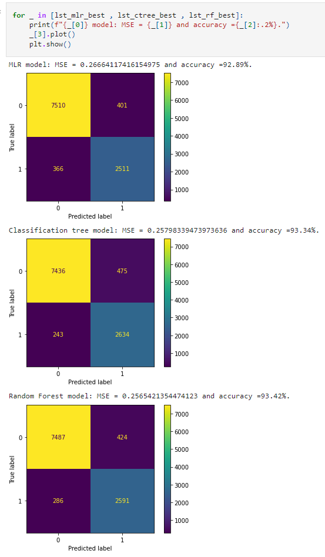

# Diamond: Classification  Models

Exam Diamond data set. Fit and evaluate models for classification purposes using sklearn module.

[Project report](https://htmlpreview.github.io/?https://raw.githubusercontent.com/chsueh2/Diamond/main/classifying_v3.html)

Key features:

- scikit-learn (sklearn)
- Training and Test Split
- MLR: Logistic Regression Model
- Classification Tree Model
- Random Forest Model
- Confusion Matrix

Modules used:

- `numpy`: Python library used for working with arrays
- `pandas`: data manipulation and analysis. In particular, it offers data structures and operations for manipulating numerical tables and time series
- `matplotlib.pyplot`: plotting library for creating static, animated, and interactive visualizations
- `sklearn`: Scikit-learn, data analysis and Machine Learning (ML) library 

## Project Report

[Project report](https://htmlpreview.github.io/?https://raw.githubusercontent.com/chsueh2/Diamond/main/classifying_v3.html) ([Jupyter Notebook](./classifying_v3.ipynb))

The analysis results with theoretical backgrounds are included.

Chien-Lan Hsueh (chienlan.hsueh at gmail.com)

## Overview and Project Goal

Split the data into a training and test set. Fit and evaluate models for classification purposes using sklearn.

## Workflow

1. Preparation and Load module
2. Read the data in
3. Split the data into a training and test set
4. For each model type, use cross-validation on the training set to select a best model
   1. MLR models with logistic regression
   1. Classification tree model
   1. Random forest model
5. Compare the best models on the test set and determine which the model has the lowest error

